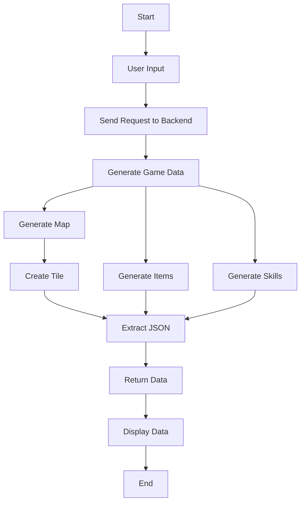

# WorldBuilder 🎮


## In the future 🌟
- **Add NPC generation**: Each NPC will have an Agent powered by LLM. 🤖  
- **Add quest generation**: A quest line will be generated by LLM for each NPC, allowing them to follow their specific purpose. 🗺️  
- **Add map control**: Users will be able to control the tile types, such as structures and special tiles. 🏗️  
- **Add PNG support**: The app will allow users to choose PNG images for tiles, items, and skills based on tags created by LLM. 🖼️  
# Adventure Game Generator 🗺️🎮

## Project Overview 🧾

**Adventure Game Generator** is a system designed to generate immersive adventure game worlds, including maps, items, and skills. Players can customize the scene background, map size, and number of items/skills, and interact with the system through a front-end **Flutter** app, which communicates with the back-end **Flask** service. The system leverages **LangChain** to efficiently generate all the game content needed by interacting with large language models.

This project demonstrates front-end and back-end communication, with the back end providing a **Flask** RESTful API and the front end using **Flutter** to fetch and display the generated game data such as maps, items, and skills.

---

## Functionality Overview 💡

1. **Game World Generation**:
   - Users provide background information and settings (e.g., map size, number of items/skills) through the Flutter app. The back-end **Flask** service processes this and generates the entire game world.
   - The system generates a map based on the provided background, with each tile having a unique description, environment details, items, and skills.

2. **Item and Skill Generation**:
   - The system generates items and skills across multiple rarity levels based on user settings.
   - Each item and skill includes detailed descriptions such as effects, duration, dice roll values, and sacrifices (e.g., body parts like the brain or heart).

3. **Map Generation and Item Assignment**:
   - The map is displayed as a grid, where each tile has a unique environment description.
   - The system assigns generated items and skills to appropriate tiles, enhancing the exploration and strategy elements of the game.

4. **Front-End and Back-End Communication**:
   - The front-end Flutter app allows users to input their settings and generate game data.
   - The back-end Flask service handles requests by calling **LangChain** to generate the game content and returning the results to the Flutter app for display.

---

## Technologies Used 🛠️

### 1. **LangChain** 🚀

LangChain is the core technology used for interacting with large language models to generate complex game elements. Key aspects of LangChain's usage in this project include:

- **Custom Tools for Generation**: Custom tools are created for each module (e.g., item generation, skill generation, and map tiles). Each tool uses carefully crafted prompt templates to ensure that the generated content fits the game’s setting.
  
- **Multi-Module Collaboration**: The system uses multiple LangChain LLMChains to generate different elements such as maps, items, and skills. These modules work together, ensuring consistency between generated elements. For example, adjacent map tiles are generated with continuity in mind.

- **Prompt Template and LLMChain**:
  - **Map Tile Generation**: Each tile is generated with detailed environmental descriptions, including furniture, characters, and items.
  - **Item and Skill Generation**: LangChain’s **LLMChain** is used to generate items and skills with specific effects, rarity levels, and other attributes, all guided by well-designed prompt templates.

- **Tool Integration and Usage**: LangChain’s **ToolUse** function allows the modularization of the generation process. Each tool (such as item generation, skill generation) is independently callable and can generate high-quality content in parallel.

- **Output Parsing**: LangChain's **JsonOutputParser** ensures that the content generated by the LLM is correctly parsed into Pydantic models, ensuring the data is formatted and usable.

### 2. **Flask (Back-End API)** 🌐

- **RESTful API Service**: The back end is powered by Flask, providing an API to handle requests from the Flutter front end. The API processes the game generation logic and returns map, item, and skill data.
- **Concurrent Processing**: The Flask service utilizes the `tenacity` library to handle retries and timeouts during content generation, ensuring stability.

### 3. **Flutter (Front-End)** 📱

- **User Interface**: The front end is built with Flutter, offering an intuitive interface where users can input game settings, such as background, map size, and the number of items/skills.
- **Data Display**: After the game is generated, the front end displays the generated map, items, and skills. Users can click to view the details of each tile, item, or skill.
- **Real-Time Interaction**: The Flutter app communicates with the Flask back end via HTTP requests, sending user inputs to the back end and displaying the generated content in real time.

### 4. **Pydantic (Data Validation)** 🔒

- **Data Models**: Pydantic is used to define data models such as `Item`, `Skill`, and `Tile`. Each model has strict field descriptions and validation rules to ensure the generated content is correct.
- **Data Validation**: Using Pydantic models, the system validates the content generated by the LLM, ensuring it follows game logic and format.

---

## How to Use 📋

### 1. Back-End (Flask) Setup

1. **Install Dependencies**:
   Install the required Python libraries by running:

   ```bash
   pip install -r requirements.txt
   ```

2. **Run Flask Service**:
Start the back-end service to provide the API for the front end:
   ```bash
   python app.py
   ```

### 2. Front-End (Flutter) Setup

1. **Flutter Environment**:
Ensure the Flutter development environment is set up and the Flutter SDK is correctly configured.

2. **Run the App**:
Run the Flutter app in a simulator or on a physical device:
   ```bash
   flutter run
   ```

### 3. Usage

1. **Input Game Background**:
In the Flutter app, enter the game background, map size, number of items, and skills.

2. **Generate Game World**:
Click the "Generate" button and wait for the game world to be created.

3. **View Generated Content**:
The map, items, and skills will be displayed on the front-end interface. Users can click to explore each tile’s details and view the items and skills within.

---


