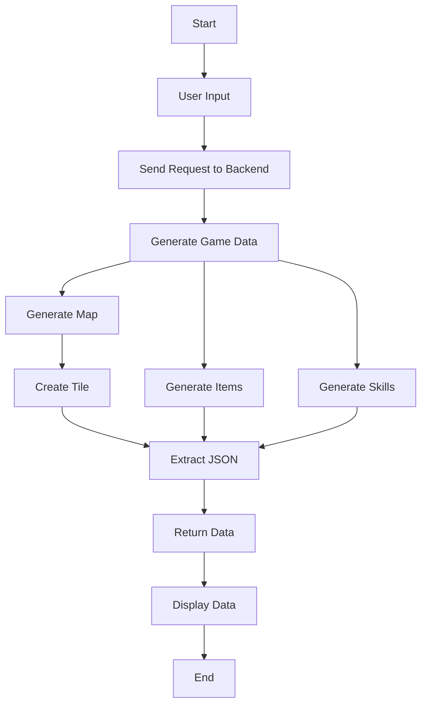

# WorldcBuilder 🎮


## In the future 🌟
- **Add NPC generation**: Each NPC will have an Agent powered by LLM. 🤖  
- **Add quest generation**: A quest line will be generated by LLM for each NPC, allowing them to follow their specific purpose. 🗺️  
- **Add map control**: Users will be able to control the tile types, such as structures and special tiles. 🏗️  
- **Add PNG support**: The app will allow users to choose PNG images for tiles, items, and skills based on tags created by LLM. 🖼️  

## Description
WorldcBuilder is a Flutter-based application designed to help users create their own role-playing games (RPGs). This project serves as a starting point for developing a fully functional RPG creator, providing essential features and a user-friendly interface. The application leverages **Flutter** technology for building beautiful and responsive user interfaces, allowing for a seamless experience across different devices. Additionally, it utilizes **Flask** for the backend, enabling robust server-side processing and dynamic content generation. The combination of these technologies allows for the creation of immersive game elements powered by AI, enhancing creativity and gameplay experience. Get ready to unleash your imagination! ✨

## Features
- **Dynamic Map Generation**: Create immersive game maps with unique tiles and descriptions. 🗺️
- **Item and Skill Creation**: Generate items and skills with specific effects, rarity levels, and descriptions. ⚔️
- **AI Integration**: Utilizes AI models to assist in generating creative content for the game. 🤖

## Workflow


## Getting Started

### Prerequisites
- Flutter SDK installed on your machine. 🛠️
- An IDE such as Android Studio, Visual Studio Code, or IntelliJ IDEA. 💻

### Installation
1. Clone the repository:
   ```bash
   git clone https://github.com/Evantakami/WorldBuilder.git
   cd WorldBuilder
   ```
2. Install dependencies:
   ```bash
   flutter pub get
   ```
3. Run the application:
   ```bash
   flutter run
   ```

## Usage
Once the application is running, you can start creating your RPG by following the on-screen instructions. Explore various features to customize your game, including skill/item creation, map building. Let your adventure begin! 🌟

## Resources
- [Lab: Write your first Flutter app](https://docs.flutter.dev/get-started/codelab)
- [Cookbook: Useful Flutter samples](https://docs.flutter.dev/cookbook)
- [Flutter Documentation](https://docs.flutter.dev/)

## Contributing
Contributions are welcome! Please follow these steps:
1. Fork the repository. 🍴
2. Create a new branch (`git checkout -b feature-branch`). 🌿
3. Make your changes and commit them (`git commit -m 'Add new feature'`). 📝
4. Push to the branch (`git push origin feature-branch`). 🚀
5. Open a pull request. 🔄

## License
This project is licensed under the MIT License - see the [LICENSE](LICENSE) file for details.
